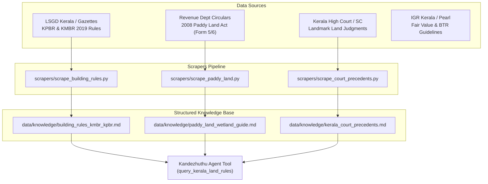
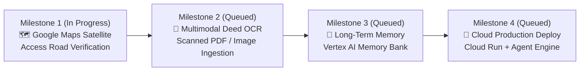

# 🌴 Kandezhuthu AI (കണ്ടെഴുത്ത് - ആധാരംനോക്കി)
## Comprehensive Master Plan: Architecture, Non-Technical UX & Parallel Data Scraping Pipeline

---

## 1. Executive Summary & Vision

**Kandezhuthu AI** is an intelligent Kerala property legal audit and title diligence assistant. It is built to solve a pervasive problem facing Kerala home buyers, NRIs, and families: **paying non-refundable token advances on legally defective land**.

Common pitfalls in Kerala real estate transactions include:
- **Wetland (*Nilam*) Traps**: Purchasing dry-looking land that is registered as *Nilam* in village records, resulting in building permit refusal under the 2008 Paddy Land Act.
- **Buried Easements (*Vazhi avakasham*)**: Hidden rights-of-way or common passages reserved in prior deeds that prevent the buyer from erecting a compound wall or gate.
- **Title Lineage Breaks (*Munnadharam*)**: Gaps in the 30-year chain of title, extent inflation (*Nemo dat quod non habet*), or omitted legal heirs under religious personal succession laws (*Mary Roy*, Hindu coparcenary, Muslim sharers).
- **Inadequate Road Width under Building Rules (KPBR/KMBR)**: Purchasing a plot with a 2-meter pathway only to discover that Kerala Building Rules mandate a minimum 3-meter motorable road for residential construction permits.

Kandezhuthu bridges this gap with a **Neuro-Symbolic architecture**: deterministic code for statutory logic, extent math, and Encumbrance Certificate (EC) cross-validation, combined with Gemini 3.8 Flash for multilingual Malayalam/English comprehension and conversational triage.

---

## 2. Architecture & Completed Components

```
kandezhuthu/
├── app/
│   ├── agent.py                 # ADK Agent definition, root prompt, and exposed tool interfaces
│   ├── fast_api_app.py          # FastAPI backend server with A2A Protocol (/a2a/kandezhuthu)
│   ├── app_utils/               # A2A routing, sessions, and GCP services
│   └── domain/
│       ├── models.py            # Pydantic schemas (DeedNode, ECRecord, RiskFlag, CleanTitleScorecard, DeedSanityResult)
│       ├── single_deed_scanner.py # SingleDeedScanner engine: 4 trap categories, scoring, Malayalam WhatsApp generator
│       └── auditor.py           # MunnadharamAuditor engine: multi-decade title chain continuity & EC cross-validation
├── frontend/                    # Dedicated Web Chat UI for Non-Technical Users
│   ├── main.py                  # Dual-mode FastAPI proxy (Local in-memory runner or Cloud A2A)
│   ├── requirements.txt         # Minimal frontend proxy dependencies
│   └── static/
│       └── index.html           # Kerala legal themed UI with quick chips & WhatsApp copier
├── scrapers/                    # [NEW] Parallel Data Scraping & Ingestion Pipeline
│   ├── scrape_building_rules.py # KMBR/KPBR 2019 road width, setback, and permit rule extractor
│   ├── scrape_paddy_land.py     # Revenue Department Form 5/6 circulars and fee slabs
│   └── scrape_court_precedents.py # Kerala High Court precedents (easements, succession, senior citizens)
├── data/
│   └── knowledge/               # Clean structured markdown corpora for agent grounding
├── GEMINI.md                    # Project-specific AI assistant guide with strict operational rules
├── plan.md                      # Complete master plan (this document)
└── pyproject.toml               # Project dependencies and configurations managed via uv
```

---

## 3. Web UI & Non-Technical User Experience (Implemented)

To ensure Kandezhuthu is genuinely useful to non-technical buyers, the interface eliminates all JSON requirements:

1. **Dedicated Browser Interface** (`frontend/static/index.html`):
   - Kerala legal aesthetic (deep forest green, warm slate, clean typography).
   - Fully responsive for mobile and desktop.
2. **One-Click Quick Action Chips**:
   - 📜 **"Try 30-Year Demo Audit"**: Instant forensic audit of a realistic 3-deed chain with an omitted heir and ghost mortgage.
   - 🔍 **"Check Pathway / Vazhi Avakasham"**: Tests deed clauses for buried easement traps.
   - 🌾 **"Check Nilam / Wetland Risk"**: Checks paddy land and unnotified data bank risks.
   - 📐 **"Check Building Road Width (KPBR)"**: Cites road width permit requirements.
   - 🚶 **"Field Verification Checklist"**: Explains physical checks on site (*Survey Kallu*, road motorability).
3. **Visual Risk Indicators**:
   - 🟢 `ALL CLEAR` (Score: 85–100)
   - 🟡 `CAUTION` (Score: 60–84)
   - 🔴 `DANGER` (Score: 0–59)
4. **Interactive WhatsApp Copier**:
   - Detects the Malayalam seller inquiry in the agent's reply and renders a dedicated **"📋 Copy Draft"** card. Users can tap once to copy and paste directly to WhatsApp.
5. **Dual-Mode Backend** (`frontend/main.py`):
   - Runs locally out-of-the-box (`python frontend/main.py` -> `http://localhost:8080`) without requiring cloud deployment.
   - Automatically switches to A2A proxy mode when `AGENT_ENGINE_RESOURCE_NAME` is configured.

---

## 4. Parallel Data Scraping Pipeline

To ground the agent on authoritative Kerala regulations, we execute three parallel scraping/curation streams:



### Parallel Knowledge Streams (Completed)
All three parallel scraping and legal curation streams are complete and stored in `data/knowledge/`:
- **Stream A (KPBR/KMBR 2019)**: `data/knowledge/building_rules_kmbr_kpbr.md` (Mandatory 3m access road under Rule 5, setbacks, small plot rules).
- **Stream B (Paddy Land & Wetland 2008 Act)**: `data/knowledge/paddy_land_wetland_guide.md` (Section 27A fee exemptions under 25 cents, Form 5/6, BTR conversion).
- **Stream C (Landmark Judicial Precedents)**: `data/knowledge/kerala_court_precedents.md` (*Mary Roy*, Senior Citizens Act Sec 23, *Sree Swayamprakash* easements, Hindu coparcenary, Muslim/Hindu minor sales, Kudikidappu tenancies, GPA *Suraj Lamp*, Lis Pendens).

---

## 5. Agent Tooling Integration (Completed)

The curated knowledge docs in `data/knowledge/` are fully wired to `app/agent.py` via `query_kerala_land_rules`:

```python
def query_kerala_land_rules(topic: str) -> str:
    """Queries the curated Kerala land regulations and judicial precedents knowledge base.

    Topics covered:
    1. Building permit road width requirements, setbacks, and small plot concessions (KPBR / KMBR 2019)
    2. Kerala Conservation of Paddy Land & Wetland Act 2008, Form 5, Form 6, Section 27A fee slabs, Nilam conversion
    3. Landmark Kerala court precedents on female Christian succession (Mary Roy), Hindu coparcenary,
       pathway easements (Sree Swayamprakash Ashramam), minor's share sales, and Senior Citizens Act maintenance.
    """
```

---

## 6. What's Next To Do: Active & Upcoming Milestones



| Milestone | Feature / Capability | Detailed Tasks & Deliverables | Status |
| :--- | :--- | :--- | :--- |
| **Milestone 1** | **🗺️ Interactive Google Maps & Satellite Ground Verification** | • Embed Google Maps JS API in `frontend/static/index.html`<br/>• Satellite & terrain layer toggle with pin-drop for Kerala villages/taluks<br/>• Road width visual estimation tool to gut-check KPBR 3-meter compliance on-ground<br/>• Visual paddy field / waterlogging overlay for village survey locations | 🔄 **In Progress** (`feature/google-maps-ui`) |
| **Milestone 2** | **📄 Multimodal Deed OCR & Document Ingestion** | • Drag-and-drop PDF/image uploader in Web UI for scanned Malayalam deeds (*ആധാരം*) & ECs (*കുടിക്കടം*)<br/>• `gemini-3.8-flash` native vision OCR to parse schedules, 4 boundaries (*ചതുരതിരുകൾ*), prior deed history (*മുന്നാധാരം*), and survey numbers<br/>• Direct piping from OCR extraction to `scan_single_deed` and `audit_prior_deeds_title` | ⏳ **Queued (Next)** |
| **Milestone 3** | **🧠 Cross-Session Long-Term Memory (Memory Bank)** | • Wire Vertex AI Memory Bank (`memory-bank-setup` skill) into `app/agent.py`<br/>• Remember user's examined properties, surveyed taluks, seller inquiries, and budget across chat sessions | ⏳ **Queued** |
| **Milestone 4** | **🚀 Production Cloud Deployment** | • Deploy backend to Agent Platform / Engine via `agents-cli deploy`<br/>• Deploy web frontend container to Cloud Run with A2A IAM token exchange proxy | ⏳ **Queued** |

---

## 7. Strict Operational Guidelines

1. **NO TESTS WITHOUT ASKING**: In accordance with user directives, never run automated unit or integration tests unless explicitly commanded.
2. **MODEL PRESERVATION**: Maintain `MODEL = "gemini-3.8-flash"`.
3. **BILINGUAL ACCURACY**: Keep accurate Malayalam terminology and natural colloquial WhatsApp questions.
4. **ETHICAL GUARDRAILS**: Never promise 100% clean title; always mandate on-site physical survey inspection (*Survey Kallu*) and formal consultation with a licensed Kerala advocate.
