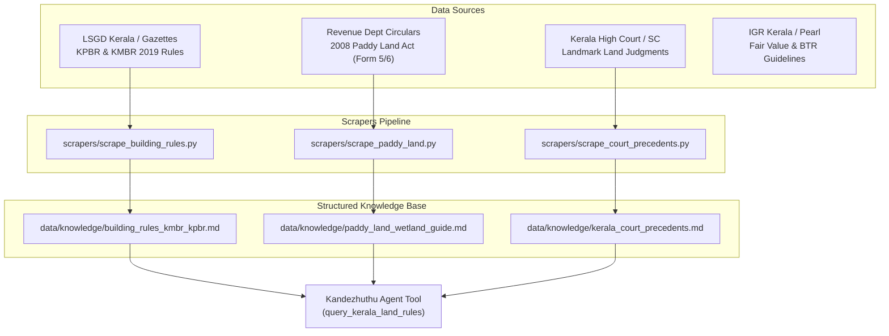

# 🌴 Kandezhuthu AI (കണ്ടെഴുത്ത് - ആധാരംനോക്കി)
## Comprehensive Master Plan: Architecture, Non-Technical UX & Parallel Data Scraping Pipeline

---

## 1. Executive Summary & Vision

**Kandezhuthu AI** is an intelligent Kerala property legal audit and title diligence assistant. It is built to solve a pervasive problem facing Kerala home buyers, NRIs, and families: **paying non-refundable token advances on legally defective land**.

Common pitfalls in Kerala real estate transactions include:
- **Wetland (*Nilam*) Traps**: Purchasing dry-looking land that is registered as *Nilam* in village records, resulting in building permit refusal under the 2008 Paddy Land Act.
- **Buried Easements (*Vazhi avakasham*)**: Hidden rights-of-way or common passages reserved in prior deeds that prevent the buyer from erecting a compound wall or gate.
- **Title Lineage Breaks (*Munnadharam*)**: Gaps in the 30-year chain of title, extent inflation (*Nemo dat quod non habet*), or omitted legal heirs under religious personal succession laws (*Mary Roy*, Hindu coparcenary, Muslim sharers).
- **Inadequate Road Width under Building Rules (KPBR/KMBR)**: Purchasing a plot with a 2-meter pathway only to discover that Kerala Building Rules mandate a minimum 3-meter motorable road for residential construction permits.

Kandezhuthu bridges this gap with a **Neuro-Symbolic architecture**: deterministic code for statutory logic, extent math, and Encumbrance Certificate (EC) cross-validation, combined with Gemini 3.8 Flash for multilingual Malayalam/English comprehension and conversational triage.

---

## 2. Architecture & Completed Components

```
kandezhuthu/
├── app/
│   ├── agent.py                 # ADK Agent definition, root prompt, and exposed tool interfaces
│   ├── fast_api_app.py          # FastAPI backend server with A2A Protocol (/a2a/kandezhuthu)
│   ├── app_utils/               # A2A routing, sessions, and GCP services
│   └── domain/
│       ├── models.py            # Pydantic schemas (DeedNode, ECRecord, RiskFlag, CleanTitleScorecard, DeedSanityResult)
│       ├── single_deed_scanner.py # SingleDeedScanner engine: 4 trap categories, scoring, Malayalam WhatsApp generator
│       └── auditor.py           # MunnadharamAuditor engine: multi-decade title chain continuity & EC cross-validation
├── frontend/                    # Dedicated Web Chat UI for Non-Technical Users
│   ├── main.py                  # Dual-mode FastAPI proxy (Local in-memory runner or Cloud A2A)
│   ├── requirements.txt         # Minimal frontend proxy dependencies
│   └── static/
│       └── index.html           # Kerala legal themed UI with quick chips & WhatsApp copier
├── scrapers/                    # [NEW] Parallel Data Scraping & Ingestion Pipeline
│   ├── scrape_building_rules.py # KMBR/KPBR 2019 road width, setback, and permit rule extractor
│   ├── scrape_paddy_land.py     # Revenue Department Form 5/6 circulars and fee slabs
│   └── scrape_court_precedents.py # Kerala High Court precedents (easements, succession, senior citizens)
├── data/
│   └── knowledge/               # Clean structured markdown corpora for agent grounding
├── GEMINI.md                    # Project-specific AI assistant guide with strict operational rules
├── plan.md                      # Complete master plan (this document)
└── pyproject.toml               # Project dependencies and configurations managed via uv
```

---

## 3. Web UI & Non-Technical User Experience (Implemented)

To ensure Kandezhuthu is genuinely useful to non-technical buyers, the interface eliminates all JSON requirements:

1. **Dedicated Browser Interface** (`frontend/static/index.html`):
   - Kerala legal aesthetic (deep forest green, warm slate, clean typography).
   - Fully responsive for mobile and desktop.
2. **One-Click Quick Action Chips**:
   - 📜 **"Try 30-Year Demo Audit"**: Instant forensic audit of a realistic 3-deed chain with an omitted heir and ghost mortgage.
   - 🔍 **"Check Pathway / Vazhi Avakasham"**: Tests deed clauses for buried easement traps.
   - 🌾 **"Check Nilam / Wetland Risk"**: Checks paddy land and unnotified data bank risks.
   - 📐 **"Check Building Road Width (KPBR)"**: Cites road width permit requirements.
   - 🚶 **"Field Verification Checklist"**: Explains physical checks on site (*Survey Kallu*, road motorability).
3. **Visual Risk Indicators**:
   - 🟢 `ALL CLEAR` (Score: 85–100)
   - 🟡 `CAUTION` (Score: 60–84)
   - 🔴 `DANGER` (Score: 0–59)
4. **Interactive WhatsApp Copier**:
   - Detects the Malayalam seller inquiry in the agent's reply and renders a dedicated **"📋 Copy Draft"** card. Users can tap once to copy and paste directly to WhatsApp.
5. **Dual-Mode Backend** (`frontend/main.py`):
   - Runs locally out-of-the-box (`python frontend/main.py` -> `http://localhost:8080`) without requiring cloud deployment.
   - Automatically switches to A2A proxy mode when `AGENT_ENGINE_RESOURCE_NAME` is configured.

---

## 4. Parallel Data Scraping Pipeline

To ground the agent on authoritative Kerala regulations, we execute three parallel scraping/curation streams:



### Stream A: Kerala Building Rules (KMBR / KPBR 2019) · [ACTIVE TASK: IN PROGRESS]
- **Status**: 🔄 **In Progress** (Claimed / Active Task)
- **Content**:
  - Minimum access road width for residential buildings (Rule 5: mandatory 3-meter motorable road).
  - Front, rear, and side setback requirements based on plot size and building height.
  - Special relaxations for small plots (plots up to 3 cents / 1.25 ares).
- **Target Output**: `data/knowledge/building_rules_kmbr_kpbr.md`

### Stream B: Kerala Conservation of Paddy Land & Wetland Rules · [PARALLELIZABLE / QUEUED]
- **Status**: ⏳ Queued (Available for parallel worker)
- **Content**:
  - Section 27A guidelines for land not included in Data Bank but recorded as *Nilam* in BTR (Basic Tax Register).
  - Form 5 application criteria (removing land erroneously included in Data Bank).
  - Form 6 application criteria (changing revenue record classification to *Purayidam*).
  - Fee exemption slabs (free up to 25 cents; percentage of fair value above 25 cents).
- **Target Output**: `data/knowledge/paddy_land_wetland_guide.md`

### Stream C: Landmark Kerala Judicial Precedents · [PARALLELIZABLE / QUEUED]
- **Status**: ⏳ Queued (Available for parallel worker)
- **Content**:
  - *Mary Roy v. State of Kerala (1986)*: Invalidated Travancore/Cochin Succession Acts; established equal inheritance for Christian women.
  - Section 23 of Senior Citizens Act (2007): Precedents on when a gift deed can be canceled if children fail to maintain parents.
  - Easement of Necessity: *Sree Swayamprakash Ashramam v. G. Anandavally Amma (2010)* on pathways running with the land.
  - Alienation of minor property: Section 8(2) Hindu Minority & Guardianship Act mandates prior District Court sanction.
- **Target Output**: `data/knowledge/kerala_court_precedents.md`

---

## 5. Agent Tooling Integration

Once the knowledge docs are in `data/knowledge/`, a lightweight retrieval tool is added to `app/agent.py`:

```python
def query_kerala_land_rules(topic: str) -> str:
    """Queries the curated Kerala land regulations knowledge base.
    
    Topics covered:
    - Building permit road widths, setbacks, small plot rules (KPBR/KMBR 2019)
    - Paddy Land Act 2008, Form 5, Form 6, fee slabs, and Nilam conversion
    - Landmark court precedents on easements, succession, and senior citizen maintenance
    """
```

This gives the agent instant, verified factual grounding without making expensive external API calls during live user chats.

---

## 6. Phased Implementation Roadmap

| Phase | Milestone | Deliverables | Status |
| :--- | :--- | :--- | :--- |
| **Phase 1** | **Core Reasoning Engine** | Single-deed scanner, 30-year Munnadharam auditor, Pydantic models, GEMINI.md guide | ✅ Completed |
| **Phase 2** | **Non-Technical Web UI** | `frontend/main.py`, `frontend/static/index.html`, quick chips, WhatsApp copier | ✅ Completed |
| **Phase 3** | **Knowledge Scrapers & Curation** | `scrapers/`, `data/knowledge/` (Stream A KPBR rules completed; Stream B & C ready) | 🔄 In Progress (Stream A Active) |
| **Phase 4** | **Knowledge Tool Integration** | `query_kerala_land_rules` tool in `app/agent.py` | ⏳ Next |
| **Phase 5** | **Multimodal Ingestion** | Support for dragging & dropping scanned deed PDFs and images | ⏳ Next |
| **Phase 6** | **Cloud Deployment** | Deploy backend to Agent Platform & frontend to Cloud Run | ⏳ Future |

---

## 7. Strict Operational Guidelines

1. **NO TESTS WITHOUT ASKING**: In accordance with user directives, never run automated unit or integration tests unless explicitly commanded.
2. **MODEL PRESERVATION**: Maintain `MODEL = "gemini-3.8-flash"`.
3. **BILINGUAL ACCURACY**: Keep accurate Malayalam terminology and natural colloquial WhatsApp questions.
4. **ETHICAL GUARDRAILS**: Never promise 100% clean title; always mandate on-site physical survey inspection (*Survey Kallu*) and formal consultation with a licensed Kerala advocate.
